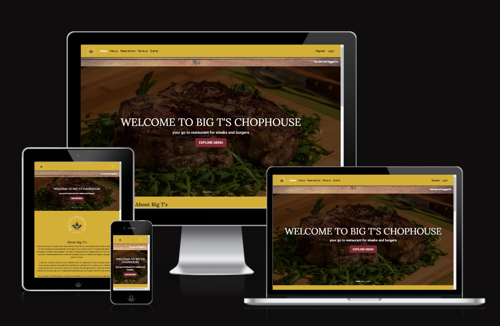
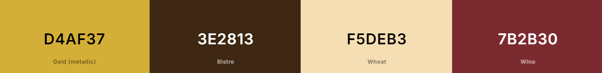
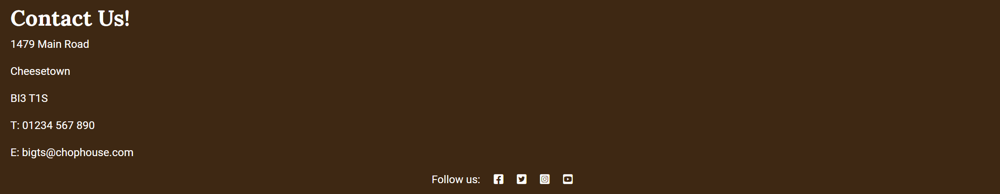
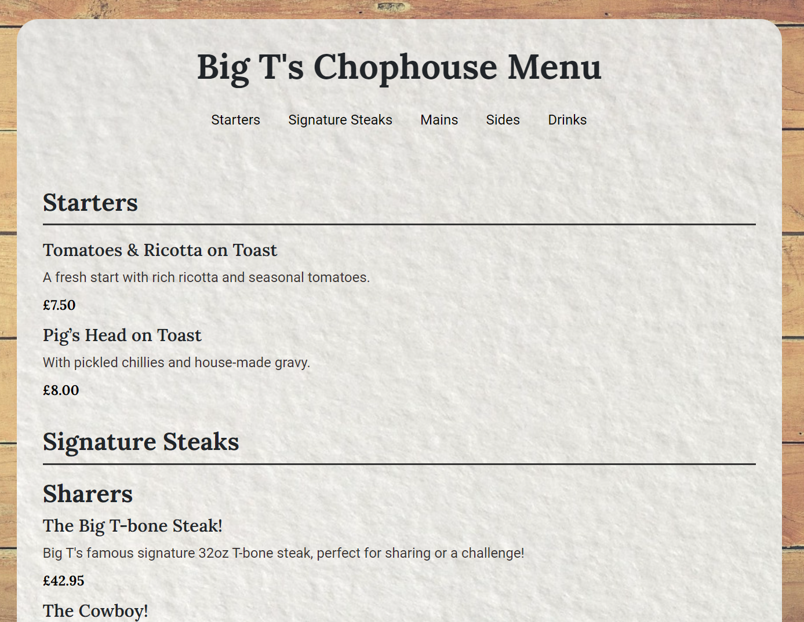
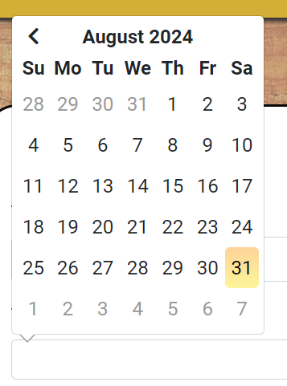

# Big T's Chophouse
Legendary super chef champion Big T is thrilled to unveil his latest culinary venture: Big T's Chophouse. This new dining destination is set to become a must-visit for meat lovers, with the award-winning 32oz Big T-bone steak taking center stage. But the delights don't stop there, Big T's Chophouse offers a mouthwatering selection of perfectly grilled steaks, tender ribs, juicy burgers, and hearty sides that cater to every carnivorous craving. And to add to that, thers live music events throughout the month.

Whether you're celebrating with friends, enjoying a romantic dinner, or just looking for the best steak in town, Big T's Chophouse promises an unforgettable experience. Come for the food, stay for the atmosphere. Big T's is where great food, good times, and memorable nights come together.

Book your table today! 

[View Big T's Chophouse website here](https://big-ts-chophouse-8ec7ab8dc652.herokuapp.com/)
- - -

## Table of Contents
### [User Experience](#user-experience-ux)
* [Project Goals](#project-goals)
* [Agile Methodology](#agile-methodology)
* [Target Audience](#target-audience)
* [First time user](#first-time-user)
* [Registered user](#registered-user)

### [Design](#design-1)
* [Colour Scheme](#colour-scheme)
* [Wireframes](#wireframes)
* [Data Model](#data-models)
* [Database Scheme](#database-schema)
### [Security Features](#security-features-1)
### [Features](#features-1)
* [Existing Features](#existing-features)
* [Features Left to Implement](#features-left-to-implement)
### [Technologies Used](#technologies-used-1)
* [Languages Used](#languages-used)
* [Databases Used](#databases-used)
* [Frameworks Used](#frameworks-used)
* [Programs Used](#programs-used)
### [Deployment and Local developement](#deployment-and-local-developement-1)
* [Local Developement](#local-developement)
* [ElephantSQL Database](#elephantsql-database)
* [Cloudinary](#cloudinary)
* [Heroku Deployment](#heroku-deployment)
### [Testing](#testing-1)
### [References](#references-1)
* [Docs](#docs)
* [Content](#content)
* [Acknowledgments](#acknowledgments)

---

## User Experience (UX)

Immerse yourself in an effortlessly engaging user experience at Big T's Chophouse. Our website combines intuitive navigation with stunning visual design, bringing the essence of our restaurant to your screen. Whether you're browsing the mouthwatering hero section, making a reservation through our streamlined booking system, or leaving a review, every interaction is smooth and enjoyable. With comprehensive information readily available and responsive support at your fingertips, your needs are met with ease. Plus, our mobile-friendly design ensures that planning your next visit is a breeze, no matter what device you're using.

### Project Goals

The primary goal of Big T's Chophouse is to deliver an exceptional customer experience on our website. This includes offering a seamless and intuitive booking system that allows users to easily create, review, edit, or cancel reservations. We also aim to provide a comprehensive and user-friendly menu display, enabling customers to explore our diverse offerings with ease. Additionally, our robust platform for managing reviews empowers customers to write, read, update, and delete their feedback effortlessly. Every element of the website is designed to ensure a smooth, satisfying, and engaging experience for all visitors.

### Agile Methodology

Agile Methodology was used to help prioritise and organise tasks, writing the user stories and using Project Boards on Github. Templates were created to help write User Stories and define Epics.

* Epics were written containing possible user stories and based on that, the website was made.
* User stories were created by looking at epics and through iterations the project was advancing.
* Project Board is set to public.
* Project Board was used to track progression of the task through the Todo, In progress and Done columns
* Labels were added to sort the issues based on their importance using the MoSCoW principle; Must have, Should have, Could have and Wont have.
* Some Could have user stories were moved to Wont haves in order to be implemented in a further iteration. 

 User Stories Template

 User Stories, Issues

 Project Board

### User Stories

User stories marked (WH) are wont haves in this iteration, however they are features left to implement in the next iteration of the design.

#### Epics
* Initial Deployment
* User Registration
* Implement Reservations
* Implement Reviews
* Create a responsive UI/UX

#### User Stories
1. Initial Deployment
*  Create new django project
*  Create Heroku app
*  Link github repository

2. User Registration
*  Create user account
*  Update user records
*  Delete user account
*  Reset password if forgotten (WH)

3. Implement an online reservation system
*  Make an available reservation
*  View reservations
*  Update reservation details
*  Cancel reservations
*  Reservation reminder (WH)

4. Reviews
*  Leave a customer review
*  Update review 
*  Delete reviews
*  Filter reviews (WH)
*  Respond to customer reviews (WH)

5. Create a responsive UI/UX
*  Design a user friendly navigation system
*  Responsive hero section

Detailed look can be found in the [project board](https://github.com/users/TrisPatt/projects/2)

### Target Audience

* The restaurant primarily targets meat lovers and food enthusiasts who appreciate high-quality ingredients and classic American cuisine.
* Those who enjoy traditional and gourmet dining experiences, particularly with a focus on steaks.
* Local residents who are looking for a reliable and enjoyable dining experience in their area.
* Visitors or tourists who are seeking a recommended spot for a great meal.
* Families looking for a comfortable and inviting place to dine.
* Couples, and groups of friends who are interested in combining dining with entertainment. This would appeal to those looking for a lively night out with food and music.
* Casual diners looking for a good meal as well as people celebrating special occasions, such as birthdays, anniversaries, or other gatherings.

### First time user

* Easy Registration process.
* Simple and intuitive website navigation for easy exploration and discovery.
* Informative content providing an overview of what is on offer from the restaurant including menu and event information.
* User-friendly forms with clear validation messages to ensure accurate input.
* Customer reviews to provide information of past experiences.

### Registered User

* Seamless login process with a secure and personalised user account.
* Ability to create a user profile
* Make reservations and reviews
* Access to a personalized dashboard displaying booking history and upcoming reservations.
* Ability to easily modify or cancel existing bookings for flexibility and convenience.
* Ability to edit or delete own reviews

## Design

The overall mood created by the colour scheme is warm and inviting, reminiscent of a cozy, classic chophouse where guests can relax and enjoy a hearty meal. The rustic tones contribute to a sense of authenticity and tradition, which is key to the restaurant's branding.
This color scheme not only reflects the restaurant's identity but also enhances the user experience by making the website visually appealing and aligned with the brand's core values.

### Colour Scheme

### Background

The background design of the website was imagined to look like a barn. This background is consistent throughout all pages of the webite ad is supposed to be in-design with the theme and colour scheme of the restaurant.

### Hero Images

All images were sourced from [Pixabay](https://pixabay.com/images/search/free%20images/) and were carefully chosen to showcase the exceptional quality of the food and entertainment available.

### Logo

The logo design was created using [Vistaprint](https://www.vistaprint.co.uk/design), ensuring it aligns with the brand's colors and theme to effectively convey the brand identity to first-time users.

### Typography

The website utilizes two primary fonts imported from [Google Fonts](https://fonts.google.com/). 
The base font for the body text is 'Roboto', a versatile sans-serif typeface known for its modern and clean appearance. For headers (h1 and h2), the font 'Lora' is employed. This serif typeface adds a touch of elegance and sophistication to the heading. These fonts were chosen with the brand and ethos in mind.

### Wireframes

I used [Figma](https://www.figma.com/) to create wireframes for both the desktop and mobile versions of the homepage. This tool allowed me to visually plan and structure the layout, ensuring a user-friendly design that adapts seamlessly across different screen sizes. By prototyping the key elements and interactions in Figma, I was able to refine the user experience before moving on to full development. 

 Home Page- Desktop

 Home Page- Mobile

### Data Models

1. AllAuth User Model
    * Django Allauth, the User model is the default user model provided by the Django authentication system.
    * The user model has a one to one bi-directional relationship with the profile model so that each user has exactly one profile, and each profile is associated with one user.
---
2. Reservation Model
    * Reservations can be made, viewed, edited and cancelled by their associated users or admins.
    * The reservation model is linked to the user model by a many to one relationship. Each reservation is made by a single user, but a user can have multiple reservations.
    * If a user is deleted either by opting to do so, or by an admin, then their reviews will also be deleted.
---
3. Review Model
    * Reviews can be created, viewed, updated and deleted by their associated users and admins.
    * The review model is linked to the user model by a many to one relationship, foreign key. Each review is written by a single user, but a single user can write multiple reviews.
    * If a user is deleted either by opting to do so, or by an admin, then their reviews will also be deleted.
---
4. Profile Model
    * The profile model allows the built-in django allauth user model to be extended so that users can add additional details. This is useful in the pre-population of form fields and saves on double keying as the only details that can entered in the allauth model are username and password, with e-mail being optional. 
    * The profile model has a one to one bi-directional relationship with the user model.
---
5. Table Model
    * The table model is linked to the reservation model through a many to many relationship. A single reservation can be associated with multiple tables, and a single table can be associated with multiple reservations. This is useful for scenarios where a large party might require more than one table, or where tables are reserved for different groups at different times.
    * Tables can be managed by admins in the user panel should the restaurant expand or decrease the number of tables or associated seats.
---
6. Time slot model
    * The Reservation model is linked to the TimeSlot model through a many-to-one relationship. Each reservation occurs at a specific time slot, but a single time slot can be associated with multiple reservations. This relationship is defined by the ForeignKey on the Reservation model.
    * Time slots can be managed by the admin in the user panel should opening hours change.
    * If a TimeSlot is deleted, all associated reservations will also be deleted.

### Database Schema

Entity Relationship Diagram (ERD)

* User: The central entity, connected to reservations, reviews, and profiles. Each user can have multiple reservations and reviews but only one profile.
* Profile: Contains additional information about the user, linked one-to-one with the User model.
* Reservation: Tied to users, tables, and time slots. A user can make multiple reservations, each linked to one or more tables and a single time slot.
* Review: Tied to a single user, allowing users to provide feedback on their dining experiences.
* Table: Can be reserved by multiple reservations, allowing flexible seating arrangements for different parties.

## Security Features

### User Authentication

* Django Allauth is a popular authentication and authorization library for Django, which provides a set of features for managing user authentication, registration, and account management.

### Login Decorator

* The @login_required decorator is used in views relating to reservations and writing, editing and deleting reviews which require authentication.
* This ensures that only authenticated users can access these views.

### CSRF Protection

* Django provides built-in protection against Cross-Site Request Forgery (CSRF) attacks. CSRF tokens are generated for each user session, and they are required to submit forms or perform state-changing actions. When a user logs out, the session and associated CSRF token are invalidated, making it difficult for an attacker to forge a valid request using a copied URL.

### Form Validation

* The create reservation form is validated to only accept dates in the future. The number of guests on a specific date and time is validated to check against restaurant capacity. Messages are displayed to the user if the validation fails. Number of guests can also not be "0".
* The create review form is validated to only accept dates from the past. 

## Features

* Home page showcases a rotating carousel that contains information and links to menu, book a table and events.
* The navigation bar displays the logo and also provides links to Home, Menu, reservations, reviews and events.
* Users can make an account and login from the right of the navigation bar.
* When logged in, users get access to create a reservation or review and update their profile.
* Users can edit and delete their reviews and reservations.
* Every user action is accompanied by a corresponding message to ensure that users are promptly notified of any changes, updates or cancellations.

### Existing Features

* Home Page
    * Displays a navigation bar with logo which links to the home page and links to other sections of the site. The hero image carousel displays links to the menu, reservation page and events section. Other sections on this page are the about section, opening times, events and footer with contact details and social links, which are intentionally not active at this time.

* Logo

* Navigation Bar
    * It differs if its a logged-in user or just a visitor

    * Navigation bar for a visitor
    

    * Navigation bar for a logged in user
    

* Hero Carousel
    * The hero carousel features engaging images with direct links to the menu, reservations, and events sections of the website, offering an interactive and visually appealing way to explore key information.

* About Section
    * This section describes what the restaurant is really about, as well as additional offerings and contains a call to action "book now" button!

* Opening Times
    * The opening times are displayed to the user!

* Events
    * Upcoming events are displayed to the user

* Footer
    * Contains contact information and social links.

* Sign up
    * User can create an account

* Login
    * User can login to an account, if they have created one

* Logout
    * User can logout

* My Account
    * Once logged in, a user can access their account menu, which appears in the top right
    * Users can modify or add personal details in their profile
    * Links to create a reservation or review as well as the home page can be found here

* Profile
    * Once logged in, users can update or add additional personal details in their profile
    * This can be useful as forms will pre-populate fields from the profile

* Profile Updated
    * Users are notified once updates are submitted

* Menu
    * Users, regardless of whether they are logged in, can easily browse the menu.
    * Navigation links are provided at the top of the page, allowing users to jump directly to different sections of the menu without needing to scroll.
    * The design of the menu is intentionally crafted to resemble a physical menu, with key sections highlighted in bold and a clear, well-structured layout that enhances readability and user experience.

* Make a reservation
    * Users are invited to make a reservation with the restaurant.
    * If details have been added to the user profile some fields will be pre-populated to save double-keying.

* Make a reservation- datepicker
    * Users can only enter future dates to make a reservation. This is displayed in the datepicker. Un-selectable dates are shown in grey.

* Booking Succesful
    * If booking is succesfull, user gets a notified message and an overview of the reservation they have made.

* Unavailable Times
    * If the date/time is unavailabe, the user is notified.
    * Tables are multiples of two with a maximum number of guests currently set to 24 in the admin panel. This can be changed with expansion of the restaurant.
    * Dates in the past are unavailable. This is validated in the front end by not allowing users to pick dates from the past either via the datepicker (javascript), or by keying directly. Logic validates this in the backend.

* Reservation List
    * Includes all of the users reservations, which have buttons to update or cancel.
    * This list is filtered by most recent reservations first.

* Edit Reservation
    * Users can change their booking and save changes.
    * If the number of guests is increased, this is again validated to check if it's available.
    * Users are notified if the restaurant cannot accept their changes.

* Cancel reservation
    * Usesr can cancel their reservation. A message is displayed asking for confirmation.
    * Once this is cancelled, the available times will be recycled.

* Write a Review
    * Users can write a review.

* Write a review- Datepicker
    * Users can only enter past dates to write a review. This is displayed in the datepicker. Un-selectable dates are shown in grey.

* Edit a Review
    * Users can modify a review they have written.
    * Users have to be logged-in.

* Delete a Review
    * User can only delete a review for which they have written and be logged in in order to do so

### Admin tasks

* Scheduled Tasks
    * Admins can log into the Django admin panel to view and manage the cron jobs
    * This task scheduler is set in the backend to check the date of reservations. If the date has past then the status of the reservation will be set to expired.

* Cron jobs log
    * The log shows all the tasks that have been completed or failed

### Permsissions

* Permissions are controlled in the Django admin panel. A general user with have permissions to control their own inputs once an account is created, whereas the admins can affect any users inputs.

### Features Left to Implement 

* Responding to customer reviews as a superuser
* Gallery page
* Setup of SMTP to send emails to user
* Sending a reservation reminder e-mail to customers
* Searchable filtering of reviews by rating
* Allowing users to rest password if forgotten

## Technologies Used

### Languages Used

* [HTML5](https://en.wikipedia.org/wiki/HTML5)
* [CSS3](https://en.wikipedia.org/wiki/CSS)
* [JavaScript](https://en.wikipedia.org/wiki/JavaScript)
* [Python](https://en.wikipedia.org/wiki/Python_(programming_language))

### Databases Used

* [ElephantSQL](https://www.elephantsql.com/) - Postgres database
* [Cloudinary](https://cloudinary.com/) - Online static file storage

### Frameworks Used

* [Django](https://www.djangoproject.com/) - Python framework
* [Bootstrap 4.6.1](https://getbootstrap.com/docs/4.6/getting-started/introduction/) - CSS framework

### Programs Used

* [Github](https://github.com/) - Storing the code online
* [Gitpod](https://www.gitpod.io/) - To write the code.
* [Heroku](https://www.heroku.com/) - Used as the cloud-based platform to deploy the site.
* [Google Fonts](https://fonts.google.com/) - Import main font the website.
* [Figma](https://www.figma.com/) - Used to create wireframes
* [DrawSQL](https://drawsql.app/diagrams) - Used to create Entity relationship diagram
* [Am I Responsive](https://ui.dev/amiresponsive) - To show the website image on a range of devices.
* [Git](https://git-scm.com/) - Version control
* [Favicon Generator](https://realfavicongenerator.net/) - Used to create a favicon
* [Pixabay](https://pixabay.com/images/search/free%20images/) - Used to for hero images
* [Vistaprint](https://www.vistaprint.co.uk/design) - Used to create a logo design
* [JSHint](https://jshint.com/) - Used to validate JavaScript
* [W3C Markup Validation Service](https://validator.w3.org/) - Used to validate HTML
* [CSS Validation Service](https://jigsaw.w3.org/css-validator/) - Used to validate CSS
* [CI Python Linter](https://pep8ci.herokuapp.com/#) - Used to validate Python

## Testing
Please see  [TESTING.md](testing.md) for all the detailed testing performed.

## Deployment and Local Developement

Live deployment can be found on this [View Big T's Chophouse live website here](https://big-ts-chophouse-8ec7ab8dc652.herokuapp.com/)

### Local Developement

#### How to Fork
1. Log in(or Sign Up) to Github
2. Go to repository for this project [Big T's Chophouse](https://big-ts-chophouse-8ec7ab8dc652.herokuapp.com/)
3. Click the fork button in the top right corner

#### How to Clone
1. Log in(or Sign Up) to Github
2. Go to repository for this project [Big T's Chophouse](https://big-ts-chophouse-8ec7ab8dc652.herokuapp.com/)
3. Click on the code button, select whether you would like to clone with HTTPS, SSH or GitHub CLI and copy the link shown.
4. Open the terminal in your code editor and change the current working directory to the location you want to use for the cloned directory.
5. Type the following command in the terminal (after the git clone you will need to paste the link you copied in step 3 above)
6. Set up a virtual environment (this step is not required if you are using the Code Institute Template in GitPod as this will already be set up for you).
7. Install the packages from the requirements.txt file - run Command pip3 install -r requirements.txt

### ElephantSQL Database
[Big T's Chophouse](https://big-ts-chophouse-8ec7ab8dc652.herokuapp.com/) is using [ElephantSQL](https://www.elephantsql.com/) PostgreSQL Database

1. Click Create New Instance to start a new database.
2. Provide a name (this is commonly the name of the project: tribe).
3. Select the Tiny Turtle (Free) plan.
4. You can leave the Tags blank.
5. Select the Region and Data Center closest to you.
6. Once created, click on the new database name, where you can view the database URL and Password.

### Cloudinary
[Big T's Chophouse](https://big-ts-chophouse-8ec7ab8dc652.herokuapp.com/) is using [Cloudinary](https://cloudinary.com/)
1. For Primary interest, you can choose Programmable Media for image and video API.
2. Optional: edit your assigned cloud name to something more memorable.
3. On your Cloudinary Dashboard, you can copy your API Environment Variable.
4. Be sure to remove the CLOUDINARY_URL= as part of the API value; this is the key.

### Heroku Deployment
* Log into [Heroku](https://www.heroku.com/) account or create an account.
* Click the "New" button at the top right corner and select "Create New App".
* Enter a unique application name
* Select your region
* Click "Create App"

#### Prepare enviroment and settings.py
* In your GitPod workspace, create an env.py file in the main directory.
* Add the DATABASE_URL value and your chosen SECRET_KEY value to the env.py file.
* Update the settings.py file to import the env.py file and add the SECRETKEY and DATABASE_URL file paths.
* Comment out the default database configuration.
* Save all files and make migrations.
* Add the Cloudinary URL to env.py
* Add the Cloudinary libraries to the list of installed apps.
* Add the STATIC files settings - the url, storage path, directory path, root path, media url and default file storage path.
* Link the file to the templates directory in Heroku.
* Change the templates directory to TEMPLATES_DIR
* Add Heroku to the ALLOWED_HOSTS list the format ['app_name.heroku.com', 'localhost']

#### Add the following Config Vars in Heroku:

* SECRET_KEY - This can be any Django random secret key
* CLOUDINARY_URL - Insert your own Cloudinary API key
* PORT = 8000
* DISABLE_COLLECTSTATIC = 1 - this is temporary, and can be removed for the final deployment
* DATABASE_URL - Insert your own ElephantSQL database URL here

#### Heroku needs two additional files to deploy properly

* requirements.txt
* Procfile

#### Deploy

1. Make sure DEBUG = False in the settings.py
2. Go to the deploy tab on Heroku and connect to GitHub, then to the required repository.
3. Scroll to the bottom of the deploy page and either click Enable Automatic Deploys for automatic deploys or Deploy Branch to deploy manually. Manually deployed branches will need re-deploying each time the GitHub repository is updated.
4. Click 'Open App' to view the deployed live site.

Site is now live

## References
### Docs

* [Stack Overflow](https://stackoverflow.com/)
* [Code Institute](https://learn.codeinstitute.net/dashboard)
* [Bootstrap 5](https://getbootstrap.com/docs/5.0/getting-started/introduction/)
* [Django docs](https://docs.djangoproject.com/en/5.1/)
* [Django Allauth](https://django-allauth.readthedocs.io/en/latest/)
* [Django and Static Assets](https://devcenter.heroku.com/articles/django-assets)
* [Cloudinary](https://cloudinary.com/documentation/diagnosing_error_codes_tutorial)
* [Google](https://www.google.com/)

### Content

*  Logo, events poster image and all other content unless stated otherwise and credited in this document, was created by me. 

### Acknowledgments

* I would like to thank my mentor for support and feedback throughout this project, Mitko Bachvarov.