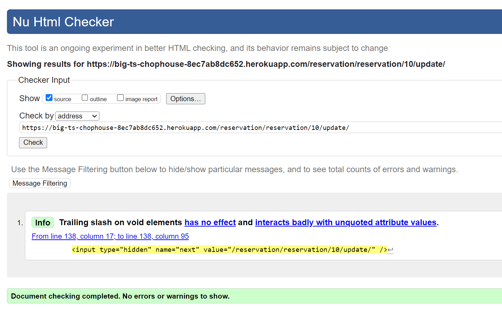
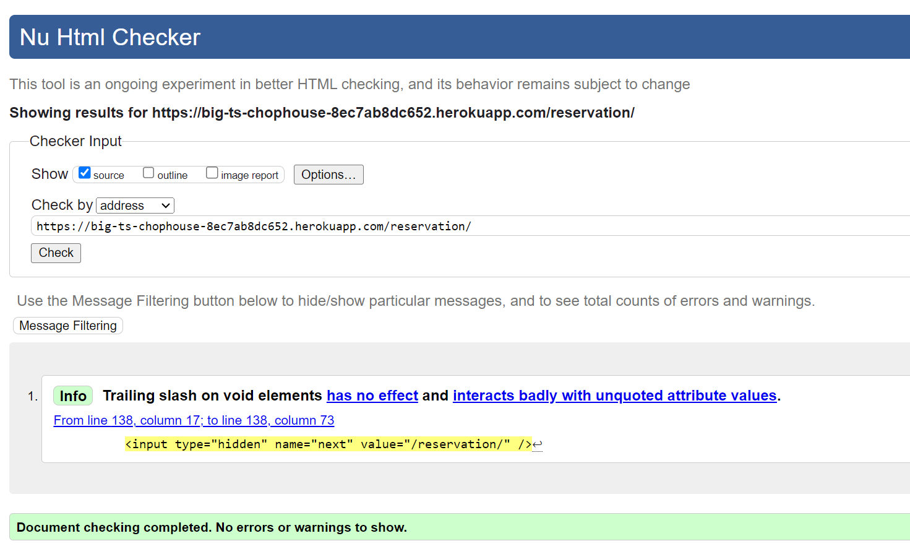
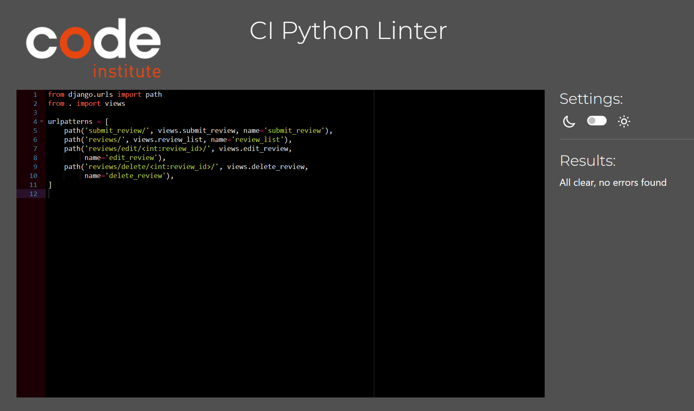
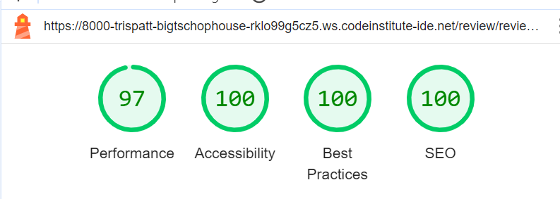

Big T's Chophouse | Testing

Return to [README](README.md)
- - -
Comprehensive testing has been performed to ensure the website's seamless and optimal functionality.

## Table of Contents
### [Responsiveness Testing](#responsiveness-testing-1)
### [Browser Compatibility Testing](#browser-compatibility-testing-1)
### [Device Testing](#device-testing-1)
### [Code Validation](#code-validation-1)
* [HTML Validation](#html-validation)
* [CSS Validation](#css-validation)
* [JavaScript Validation](#javascript-validation)
* [Python](#python)
### [Lighthouse Report](#lighthouse-report-1)
### [Bugs](#bugs-1)
* [Resolved Bugs](#resolved-bugs)
* [Unresolved Bugs](#unresolved-bug)
### [Features Testing](#features-testing-1)
---

## Responsiveness Testing

The deployed website underwent rigorous testing on multiple devices and screen sizes to ensure its responsiveness and adaptability. Developer Tools were utilized to simulate various screen sizes, enabling thorough examination of how the website behaves across different devices. Bootstrap classes and media queries were implemented to achieve the desired design, ensuring that the website maintains its visual and functional integrity on all platforms, enhancing the user experience.

 Desktop PC

 Laptop

 Tablet

 Mobile

## Browser Compatibility Testing

The project was tested on multiple web browsers to check for compatibility issues and ensure it functions as expected across all of them. This testing process guarantees a smooth and consistent user experience, regardless of the browser used.

 Chrome

 Microsoft Edge

 Opera

 iphone (Mobile)

## Device Testing

Device testing was conducted on a variety of phone models, including Samsung Galaxy A52, Oppo, iPhone 12, Huawei. The assistance of family members and friends was sought to perform the testing. This comprehensive approach ensured that the website was thoroughly evaluated on different devices and platforms, contributing to a more robust and user-friendly final product.

## Code Validation

### HTML Validation

 Home Page

 Menu Page

 Register Page

 Login Page

 Logout Page

 My Account Page

 Update Profile page

 Profile updated confirmation page

 Create Reservation Page

 Update Reservation Page

 Cancel Reservation Page

 Reservation Confirmed

 My Reservations

 Review List

 Write a review

 Edit Review

 Delete Review

### CSS Validation

 Custom CSS (style.css)

### JavaScript Validation

 Custom JS (script.js)

### Python

####  Reservation app

 admin.py

 forms.py

 models.py

 views.py

 urls.py

 cron.py

####  Review app

 admin.py

 forms.py

 models.py

 views.py

 urls.py

####  User_profile app

 admin.py

 forms.py

 models.py

 views.py

 urls.py

#### Big app

 settings.py

 urls.py

## Lighthouse Report

 Home Page

 Sign Up Page

 Login Page

 Logout Page

 My account Page

 Create Booking

 Booking Success Page

 My Reservations

 Cancel booking

 Reviews Page

 Delete Review

## Bugs

### Resolved Bugs

| Page          | User Action   | Expected Result  | Actual Result    |       Fix        |
|---------------|---------------|------------------|------------------|------------------|
| Create Reservation | Enter "0" for number of guests | Displays error message "at least one guest must be entered | redirects to booking confirmation page showing 0 guests booked | change to logic etc....   |
|               |               |                   |                 |                  |
|               |               |                   |                 |                  |
|               |               |                   |                 |                  |
|               |               |                   |                 |                  |

### Unresolved Bugs

* No known bugs

## Manual user testing script
 
| Page          | User Action   | Expected Result  | Actual Result    |
|---------------|---------------|------------------|------------------|
| Home Page     |               |                  |                  |
|               | Click on Logo | Redirect to Home Page | PASS        |
|               | Click on carousel control | Move left, move right | PASS |
|               | Click on "explore menu" button from the carousel| redirect to menu page | PASS |
|               | Click on "Book now" button from the carousel| redirect to create reservation page | PASS |
|               | Click on "Events" button from the carousel | Jump to Events section on home page | PASS |
|               | Click on "book a table" button from about section | redirect to create reservation page  | PASS |
|               | Click on Menu link (Navigation bar) | Move to menu section | PASS |
|               | Click on link for starters at the top of menu for the starter menu sections | move to starter section | PASS |
|               | Click on link for signature steaks at the top of menu for the steak menu section | move to signature steak section | PASS |
|               | Click on link for Mains at the top of menu for the Mains menu section | move to Mains menu section | PASS |
|               | Click on link for sides at the top of menu for the sides menu sections | move to sides menu section | PASS |
|               | Click on link for drinks at the top of menu for the drinks menu sections | move to drinks menu section | PASS |
|               | Click on link for events in the navigation bar | move to events section on the home page| PASS |
|               | Click on Register link (Navigation bar) | Redirect to Sign Up page | PASS |
|               | Fill out required fields (username and password) and signup | Redirect to home page with a success message "Successfully signed in as ..."| PASS |
| Home Page (Logged In - User)  |   
|               | After Login | Users name is displayed in top right of navigation bar | PASS |              |          |  |
|               | After Login | Sign Up link now displays as "logout" and "My Account" | PASS |
| Reservation   | Click on reservations link in navigation bar | Displays create reservation form | PASS |
|               | Complete reservation form with valid date and time (in the future), number of guests below 24 and other required information and click submit button | Displays confirmation message containing your entered date and time and number of guests. (if access to the terminal, this will display an email confirmation message) | PASS |
|               | click on back to Home button| Redirects to homepage | PASS |
|               | Click on Reservations link in navigation bar | redirects to create reservation form | PASS |
|               | Complete reservation form with an invalid date (in the past) | Datepicker will only allow for the current date or dates in the future to be selected | PASS |
|               | Complete reservation form with valid date and time and name but enter an invalid email address (eg, a single letter, number without the "@" and ".") | Will not allow user to proceed without a valid email address | PASS |
|               | Complete reservation form with valid date and time, names and valid email address. Enter nummber of guests with a number over 24 | Displays error message with the number of available seats at that time. Displays error message in top left under navigation bar | PASS |
|               | Complete reservation form with valid date and time, names and valid email address. Enter nummber of guests as 0 | Displays error message with you must select at least 1 guests | FAIL |
|               | Complete reservation form with valid date and time (in the future), number of guests below 24 and other required information and click submit button | Displays confirmation message containing your entered date and time and number of guests. (if access to the terminal, this will display an email confirmation message) | PASS |
|               | click on view my reservations button| Redirects to reservations list| PASS |
|               | click on update button next to your reservation | Redirects to create reservation with fields prepoulated| PASS |
|               | change the number of guests but so that the number is less than the maximum 24 but different to what is there already| Displays a confirmation box with your reservation was successfully updated in the top left | PASS |
|               | click on view my reservations button. Should show the update of guests | Redirects to reservations list.| PASS |
|               | click on cancel button next to your reservation| Displays confirm cancellation screen | PASS |
|               | click on submit| Redirects to my reservations, displays cancel confirmtion in top left and changes the status of the reservation to cancelled in red | PASS |
|               | click on cancel button next to your reservation| Displays confirm cancellation screen | PASS |
|    Reviews    | Click on Reviews link in navigation menu | Redirect to display reviews | PASS |
|               | Click on Reviews write review button| Redirect to submit a review form | PASS |
|               | Click submit with a blank form | does not allow mandatory fields to be left blank | PASS |
|               | Complete all fields including a invalid date (a date in the future Try with the datepicker or by typing directly (format is yyyy/mm/dd))| Does not allow a date from the future to be added | PASS |
|               | Try again with a valid date and click submit| confirmation message appears in top left, thanking user and displays review at top of the page. The logged in user can now see the edit and delete buttons next to their review only | PASS |
|               | Click on edit button next to your review| Displays a pre-populated review form with details previously entered| PASS |
|               | Edit some or all fields and save changes| redirects to review list displaying the changes made. Displays a message in the top left confirming the chages | PASS |
|               | Click on delete button next to your review| Redirects to confirm delete page | PASS |
|               | Click on confirm buttonn| Redirects to review page, the deleted review has been deleted, a confirmation message is displayed in top left| PASS |
|   My Account  | Click on My Account link on top right of navigation bar| Redirects to My account page | PASS |
|               | Click on Home page button| Redirect to homepage | PASS |
|               | Go back to My Account screen and click update my details button| Redirect to update profile form | PASS |
|               | Complete all fields including the validated email field and date of birth and click update| redirects to Profile updated | PASS |
|               | Click back to home button| redirects to home page| PASS |
|               | Go back to My Account section, click My Reservations button| redirects to my reservation list| PASS |
|               | Go back to My Account section, click My Reviews button| redirects to reviews list| PASS |
|               | Click on Logout | Redirect to Logout confirmation Page | PASS |
|               | Click on signout | Redirect to home Page, displays confirmation of user logged out in top left and how user not logged in top right | PASS |
| Login Page  |                  |                  |                  |
|               | Click on login in navigation bar | Redirect to Sign in page | PASS |
|               | Try invalid username | Username is not correct | PASS |
|               | Try invalid password | Password is not correct | PASS |
|               | sign in with correct login details| Logs in, confirmation message displayed in top left | PASS |
|   My Account  | Click on My Account link on top right of navigation bar| Redirects to My account page | PASS |
|               | Click on update my details button and then delete my account| redirects to confirm deletion page and warns user this cannot be undone | PASS |
|   My Account  | Confirm deletion| Redirects tohome page, displays confirmation of deletion in top left | PASS |
|               | Click on Reviews link on top right of navigation bar| Redirects to Reviews page | PASS |
|               | Check to see if any of your reviews are there| Once user deletes account, reviews are automatically deleted | PASS |

Return to [README](README.md)